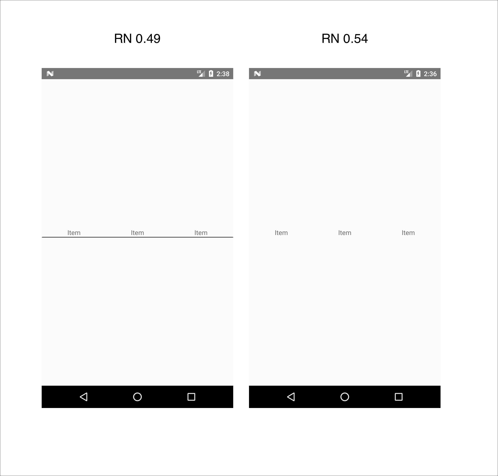

# React Native Scroll View regression

It looks like a visual regression bug has been introduced between version 0.49 and version 0.52 of React Native, using `ScrollView` on Android, if a custom style for the border is passed to the `contentContainerStyle` that border doesn't get rendered at all.

Screenshots:




To replicate the bug clone this repository and run:

```sh
npm i
npm start
```
then, after starting the android emulator, in a different terminal tab run

```sh
npm run android
```

the renderd view should have a border bottom


After that, upgrade React Native to 0.52/0.54 by running

```sh
rm -rf node_modules
npm i react@16.2.0 --save
npm i react-native@0.54.0 --save
npm i
```

then restart the React Packager by closing the process created with `npm start` and re-run `npm start` once that is done, re-deploy the Android app by running `npm run android`

once it's all booted up the same view as before should render but without the border bottom.

